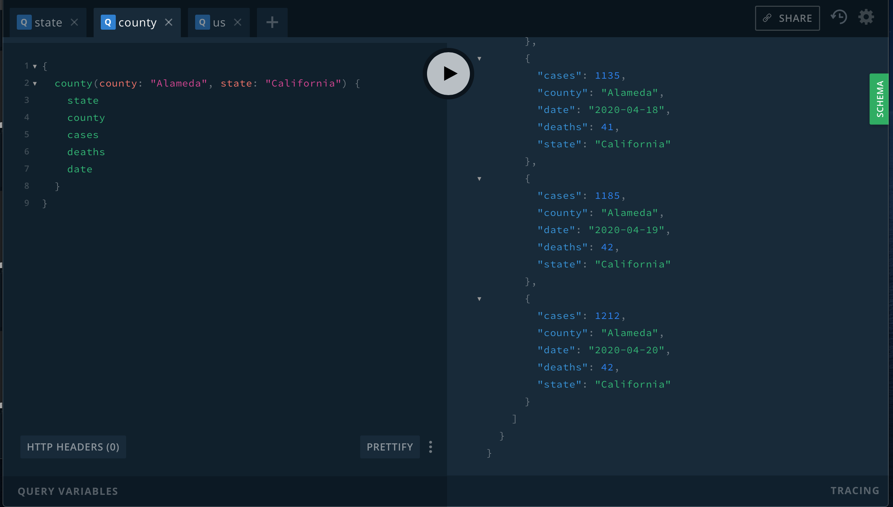

# Covid19 Data 

This is a [Phoenix][0] application that exposes the data from the [New York Times][1] [Coronavirus (Covid-19) Data in the United States][2] data set. This is “Data from The New York Times, based on reports from state and local health agencies.” For more information, see their [tracking page][3].

## Warning, Disclaimer, etc.

This is not my data. I do not work for The New York Times. I do not have any control over the data itself, nor can I vouch for its accuracy. If you have any questions or concerns with the data please see the contact info in their GitHub [repository][2].

## Endpoints

This project is currently live on Heroku, with the following endpoints available (more to follow):
 * https://still-sea-82556.herokuapp.com/gql - GraphQL playground: simple queries for state, county and US data
 * https://still-sea-82556.herokuapp.com/api/bay_area - all data for SF Bay Area counties
 * https://still-sea-82556.herokuapp.com/api/states - see all state level data
 * https://still-sea-82556.herokuapp.com/api/counties - see all county level data
 * https://still-sea-82556.herokuapp.com/api/state/state_name - see all data for the supplied state, i.e. [California][4]. State name matching is case insensitive but you must escape spaces in states that have multiple words, i.e. [West%20Virginia][5]
 * https://still-sea-82556.herokuapp.com/api/state/state_name/counties/county_name - see all data for the supplied state and county. state and county names are case insensitive and spaces must be escaped.
 * https://still-sea-82556.herokuapp.com/api/fips/two_or_five_digit_code - look up states or counties by their [Federal Information Processing Standards (FIPS)][6], i.e. [Alameda County][7].
 * https://still-sea-82556.herokuapp.com/api/missing_fips - some records in the county data are missing fips. this endpoint displays them all.
 * https://still-sea-82556.herokuapp.com/api/us - all us data.
 * more to come ...

## Screenshot

## Status

This is a hobby project and is a work in progress, therefore it may be broken or incomplete at times. If you happen to find this useful or have any suggestions or problems, please let me know, file an issue, contribute, etc.

## Tech stuff

This is a [Phoenix][0] project written in [Elixir][8]. It uses [Absinthe][9] for GraphQL.

### Data

The data sets are two CSV files. They are pulled via HTTP hourly, parsed and loaded into a Postgres database. The data model is simple and mirrors that of each data set. The two sets are completely independent. The HTTP ETag is respected so that file are only pulled and parsed if they've changed since the last pull (or last app tartup since the ETag data is stored in memory). As of today, it looks like the files are updated daily, sometimes several times to fix incorrect data, so an hourly pull should keep this application's data fresh.

Because each data point represents a single day's numbers (Covid19 cases and deaths per day per state or county), the data is continually growing and periodically adjusted to reflect new information. To model this on the database side, rows have a unique constraint on the date and state (and county for county data) so that revised data is fixed rather than added. 

## TODO

* the CSV parsing pipelines could be more `dry`, lots of repeated code
* docs in the code
* tests
* configify the CSV urls and make local endpoints to serve for testing and development

### Running locally

To start your Phoenix server:

  * Install dependencies with `mix deps.get`
  * Create and migrate your database with `mix ecto.setup`
  * Install Node.js dependencies with `cd assets && npm install`
  * Start Phoenix endpoint with `mix phx.server`

Now you can visit [`localhost:4000`](http://localhost:4000) from your browser.

Ready to run in production? Please [check our deployment guides](https://hexdocs.pm/phoenix/deployment.html).

## Learn more

  * Official website: https://www.phoenixframework.org/
  * Guides: https://hexdocs.pm/phoenix/overview.html
  * Docs: https://hexdocs.pm/phoenix
  * Forum: https://elixirforum.com/c/phoenix-forum
  * Source: https://github.com/phoenixframework/phoenix

[0]: https://www.phoenixframework.org
[1]: https://nytimes.com
[2]: https://github.com/nytimes/covid-19-data
[3]: https://www.nytimes.com/interactive/2020/us/coronavirus-us-cases.html
[4]: https://still-sea-82556.herokuapp.com/api/state/california
[5]: https://still-sea-82556.herokuapp.com/api/state/west%20virginia
[6]: https://en.wikipedia.org/wiki/Federal_Information_Processing_Standards
[7]: https://still-sea-82556.herokuapp.com/api/fips/06001
[8]: https://elixir-lang.org
[9]: https://absinthe-graphql.org
